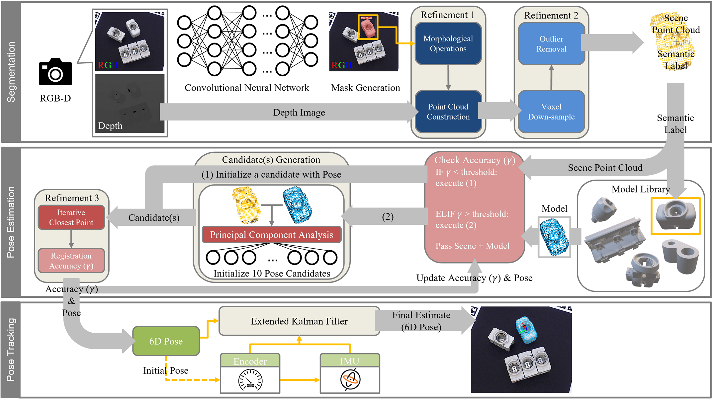

# DNNPOSE

Online object 6D pose estimation for Human Support Robot([HSR](https://mag.toyota.co.uk/toyota-human-support-robot/)) from Toyota Research Institute.

Project under Barton Research Group ([BRG](https://brg.engin.umich.edu/)), via Multidisciplinary-Design-Program ([MDP](https://mdp.engin.umich.edu/)) at the University of Michigan. The repository only provides a pipeline for ***6D pose estimation using an RGB-D image*** at the moment.

<!-- 

 

 -->

## Table of Contents

- [Repository Structure](#repository-structure)
- [Download Process](#download-process)
- [How to Run](#how-to-run)
    - [DNNPOSE](#dnnpose)
    - [Sensor Fusion](#sensor-fusion)
- [Citation](#citation)
- [ToDo Lists](#todo-lists)

---

## Repository Structure

    ├── dnnpose
    │   ├── launch             # ROS launch file
    │   └── src
    │       ├── yolact   
    │       ├── dnnpose_utils                      
    │       └── estimation.py  # Python code for OPE                    
    └── images
    
## Download Process

    cd ~/catkin_ws/src
    git clone https://github.com/kidpaul94/MS-DPT.git
    cd ~/catkin_ws
    catkin_make
    source devel/setup.bash

## How to Run

### DNNPOSE:

    cd dnnpose/src/
    rosrun estimation.py --trained_model=your_weights.pth --config=yolact_plus_resnet50_config --score_threshold=0.90

### Sensor Fusion:

 

## Citation

    @article{lee2022multi,
      title={Multi-sensor aided deep pose tracking},
      author={Lee, Hojun and Toner, Tyler and Tilbury, Dawn and Barton, Kira},
      journal={IFAC-PapersOnLine},
      volume={55},
      number={37},
      pages={326--332},
      year={2022},
      publisher={Elsevier}
    }

## ToDo Lists

| **Refactorization** |  |
| --- | --- |
| **Multi-sensor fusion** |  |
